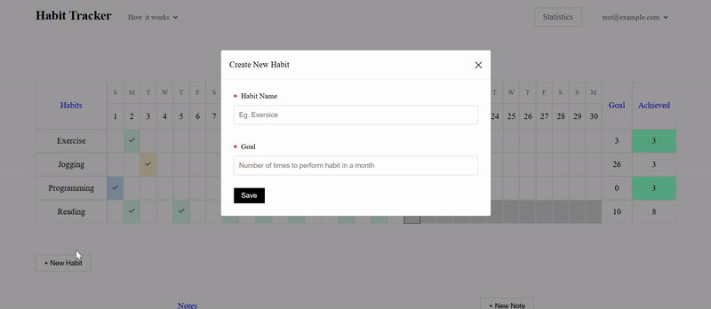

# Habit Tracker Web App

🔗 Live Website[` Habit Tracker`](https://habit-tracker-five-jet.vercel.app/)

A modern web application that helps users track daily habits, set monthly goals, and visualize progress with interactive statistics and charts.

## Demo

## Responsive Web Design

## Features

- **Authentication**

  - Sign up, login, and logout with Firebase Authentication
  - React Context handles global auth state

- **Habit Management**

  - Add, edit, delete, archive habits
  - Set monthly goals for each habit
  - Drag and drop to reorder habits

- **Daily Tracking**

  - Mark daily habit completions (check)
  - All check states are saved in Firestore per habit and date

- **Note Section**

  - Make daily notes to keep a track

- **Statistics Page**

  - View habit streaks, monthly goal completion rate, and yearly trends
  - Circle progress indicators for goal/month completion
  - Line chart for 12-month performance

- **Calendar Support**

  - Month selector for viewing past habit records
  - Data visualization changes according to selected month

## Tech Stack

## Component Structure

## Architecture Highlights

- **React Context** for global user state management
- **Custom Hooks** for abstracting logic:

  - `useAuth` for login status
  - `useMonth` for consistent month/year state
  - `useHabits` for syncing habit and check data
  - `useDrag` for encapsulates the logic for drag-and-drop sorting of habit items
  - `useEscape` for centralized handler for closing interactive modals using the Escape key

- **Component-based structure** with separation of UI, state, and logic
